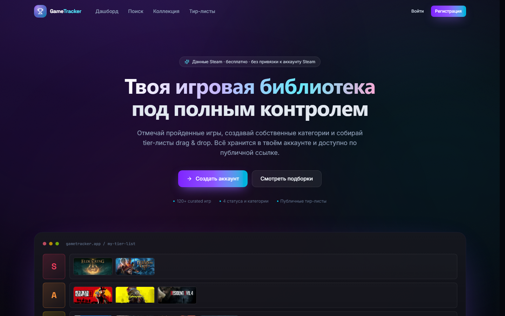

# GameTracker

<p align="center">
  <b>Трекер игровой коллекции</b> — отмечай пройденные игры, собирай категории, создавай tier-листы drag & drop
  и делись коллекцией с друзьями по ссылке или прямо из своей вкладки «Друзья».
</p>

<p align="center">
  <a href="https://denisgorbatkin5-ai.github.io/GameTracker/"><b>🌐 Демо</b></a>
  ·
  <a href="#возможности"><b>Возможности</b></a>
  ·
  <a href="#архитектура"><b>Архитектура</b></a>
  ·
  <a href="#быстрый-старт"><b>Быстрый старт</b></a>
  ·
  <a href="#безопасность"><b>Безопасность</b></a>
</p>

<p align="center">
  
  
  
  
  
  
</p>

---

## Что это

Сервис, где игрок ведёт свою библиотеку: статус игры, оценка, часы, личные заметки, категории
(«Пройти», «На_ум», «Купить») и рейтинг игр в формате tier-листа. Данные об играх подтягиваются из
Steam, аккаунты и синхронизация — Supabase.

Ключевая деталь проекта — **друзья с приватностью по умолчанию**: коллекция закрыта от всех, кроме
друзей, а друзей не нужно искать по ссылкам — есть отдельная вкладка с заявками и быстрым переходом
в коллекцию друга.

## Возможности

| | |
| --- | --- |
| **Коллекция** | статусы (играю / пройдено / брошено / в планах), оценка 1–10, часы, заметки, дата финала |
| **Категории** | свои категории с drag & drop сортировкой |
| **Tier-листы** | конструктор drag & drop (dnd-kit), S→F ранги, режимы public / только для друзей / приватный |
| **Друзья** | заявка по нику, входящие/исходящие, accept / reject / удалить, виджет «Друзья» прямо в дашборде |
| **Витрина профиля** | до 6 игр из своей коллекции, сортируются в одну секунду |
| **Steam-поиск** | поиск по русским и английским названиям, топы продаж / скидок / новинок |
| **PWA-ready** | тёмная aurora-тема, glassmorphism, адаптив от мобилки до десктопа |

## Архитектура

```
React SPA (Vite, TS, Tailwind)
├── useAuth / useLibrary / useFriends        — состояние на контекстах
├── lib/api.ts                              — Supabase + SQL RPC
└── lib/steam.ts                            — proxy-first, Steam RPC fallback

Postgres / Supabase
├── RLS: коллекция и категории — только владелец
├── RLS: тир-листы — владелец + все (если is_public / friends_visible)
├── security-definer RPC                    — can_view_profile, profile_collection,
│                                              profile_showcase_games, add_friend,
│                                              respond_friend, username_available
└── steam_fetch RPC + http extension        — CORS-прокси к Steam для статических хостов

Steam Web API
└── server/steam-core.ts                    — общая логика + кэш в памяти 30 мин
    ├── plugins/steamApiPlugin.ts           — dev-прокси
    └── api/steam.ts                        — serverless-прокси (Vercel)
```

Ключевое решение: чужие данные **никогда** не читаются напрямую из таблиц (они под owner-only RLS) —
только через `security-definer` RPC, который сам решает, есть ли у зрителя право на просмотр.

## Скриншоты



> Кадры дашборда, тир-листа и вкладки «Друзья» добавятся сюда же:
> `docs/dashboard.png`, `docs/tier-list.png`, `docs/friends.png`.

## Быстрый старт

```bash
git clone https://github.com/denisgorbatkin5-ai/GameTracker.git
cd GameTracker
npm install
cp .env.example .env        # заполни VITE_SUPABASE_URL и VITE_SUPABASE_ANON_KEY
npm run dev                 # http://localhost:5173
```

## Переменные окружения

| Переменная | Назначение |
| --- | --- |
| `VITE_SUPABASE_URL` | URL проекта Supabase |
| `VITE_SUPABASE_ANON_KEY` | anon public ключ |
| `SUPABASE_PROJECT_REF` | ref проекта (для миграций) |
| `SUPABASE_DB_PASSWORD` | пароль БД (только для миграций, в клиент не попадает) |
| `SUPABASE_DB_REGION` | регион connection pooler, по умолчанию `eu-west-2` |

`.env` в `.gitignore`, наружу попадает только anon-ключ.

## База данных

Схема — [`supabase/schema.sql`](supabase/schema.sql):

```bash
npm run migrate    # применить автоматически через pg + connection pooler
# или вручную: Supabase Dashboard → SQL Editor → вставить supabase/schema.sql
```

Создаётся: `profiles`, `games` (кэш Steam), `collection_items`, `categories` / `category_items`,
`tier_lists` / `tier_rows` / `tier_items`, `friendships`, `profile_showcase` + RLS-политики.

### Друзья и приватность

| RPC | Что делает |
| --- | --- |
| `username_available(text)` | проверка ника для формы регистрации |
| `add_friend(text)` | заявка по нику; повторная заявка сразу превращается в `accepted` |
| `respond_friend(bigint, boolean)` | принять / отклонить (принять может только получатель) / отозвать |
| `can_view_profile(uuid)` | профиль виден, если публичный или вы друзья |
| `profile_collection(text)` | коллекция друга; личные `notes` не отдаются никогда |
| `profile_showcase_games(text)` | витрина друга |

Приватный профиль и коллекция видны только принятым друзьям. Тир-лист — только если у автора включён
`friends_visible`. Заявки нельзя принять дважды, нельзя задублировать и нельзя выдать себе дружбу.

## Steam API

Steam-магазин **не отдаёт CORS-заголовки**, поэтому браузер не может обратиться к нему напрямую —
проверено: `store.steampowered.com/api/*` отвечает без `Access-Control-Allow-Origin`. Нужен прокси,
и их два:

1. **Serverless-прокси** — когда хост умеет serverless-функции:
   - локально — `plugins/steamApiPlugin.ts`;
   - на Vercel — `api/steam.ts`.
2. **Прокси на стороне Postgres** — работает на любом статическом хостинге, включая GitHub Pages:
   расширение `http` делает запрос из базы, а RPC `steam_fetch(text, text, bigint)` отдаёт
   нормализованный JSON клиенту.

Клиент пробует `/api/steam`, при 404 переключается на RPC и больше не тратит время на попытки.
plpgsql-http кэширует ответы в коннекте (`http_curl_ttl`, 6 часов), поэтому повторные запросы
бесплатны. Общая логика нормализации — `server/steam-core.ts`.

| `p_path` | Ответ |
| --- | --- |
| `search` | `{ "results": [{ appid, name, icon, logo }] }` — до 24, русский + английский проход |
| `app` | `{ "game": SteamGameLite \| null }` — цена, жанры, платформы, Metacritic, дата выхода |
| `featured` | `{ "topSellers": [...], "specials": [...], "newReleases": [...] }` — по 18 игр |

Любой другой `p_path` отклоняется, так что RPC нельзя превратить в открытый прокси.

> Steam ищет по названиям того магазина, который отдаёт: кириллица находится только в российском
> каталоге (`cc=RU`), латиница — в полном американском (`cc=US`). Поэтому поиск делает два
> прохода и ранжирует тот, который соответствует языку запроса.

Обложки игр отдаются с CDN Steam (`cdn.cloudflare.steamstatic.com`) и не требуют прокси.

## Тесты и проверки

```bash
npm run build       # tsc -b + production-сборка
npm run verify:rls  # 40 проверок RLS/RPC на живой базе
npm run check:steam # поиск / карточка / топы через steam_fetch RPC
```

`verify:rls` создаёт временных пользователей, проверяет приватность, заявки, витрину, тир-листы
и правила ника, после чего сам себя чистит — можно запускать повторно.

## Деплой

**GitHub Pages** (используется как основной, `.github/workflows/pages.yml`): base path берётся из
имени репозитория, SPA-маршруты закрываются файлом `404.html`.

**Vercel** (`vercel.json`): rewrite всех маршрутов на `index.html`, `/api/*` не перехватывается.
Нужны те же `VITE_*` переменные в Variable Encryption.

## Безопасность

- Row Level Security на всех пользовательских таблицах; тесты в CI-стиле `npm run verify:rls`.
- `notes`, категории и коллекция читаются только владельцем.
- Секреты не попадают в клиент и репозиторий; используется anon-ключ.
- Регистрация требует уникальный ник, проверяется и на клиенте, и на сервере (триггер + RPC).

## Команды

```bash
npm run dev         # dev-сервер с Steam-прокси
npm run build       # tsc -b + production-сборка
npm run preview     # предпросмотр сборки
npm run migrate     # применить supabase/schema.sql
npm run verify:rls  # 40 проверок RLS/RPC (тестовые юзеры удаляются)
```

## Лицензия

MIT © [denisgorbatkin5-ai](https://github.com/denisgorbatkin5-ai)
